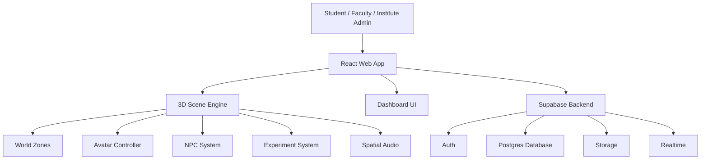

# Project Architecture

## Architecture Goal

RealLabVerse should be built as a modular simulation platform, not a one-time demo. Every system must support future expansion into more campuses, labs, experiments, institutes, dashboards, and multiplayer sessions.

## High-Level Architecture



## Core Modules

### Auth Module

- User login
- Role detection
- Institute membership
- Session persistence

### World Module

- Hostel room
- Hostel corridor
- Campus
- Department building
- Laboratory
- Scene transitions
- Spawn points
- Collision boundaries

### Avatar Module

- Player movement
- Camera control
- Animation states
- Interaction targeting

### Interaction Module

- Doors
- Lifts
- Stairs
- Laptop
- Lab attendance
- PPE
- Instruments
- Reagents
- Waste disposal

### NPC Module

- Faculty
- PI
- PhD scholars
- M.Tech students
- MSc students
- Interns
- Lab assistants
- Hostel staff
- Security guards

### Experiment Module

- SOP steps
- Reagent collection
- Measurements
- Instrument usage
- Step validation
- Result calculation
- Mistake reporting

### Contamination Module

- Glove status
- Sterility tracking
- Bench contamination
- Waste handling
- Instrument misuse
- Result penalties

### Dashboard Module

- Student progress
- Faculty assignments
- Mistake reports
- Certificates
- Institute setup

## Recommended Repository Structure

```text
ResearchLabSimulator/
  README.md
  docs/
    architecture/
    database/
    experiments/
    user-flows/
    roadmap/
    decisions/
  public/
    assets/
      audio/
      models/
      textures/
      icons/
  src/
    app/
    config/
    lib/
    types/
    modules/
      auth/
      world/
      avatar/
      interactions/
      npc/
      lab-access/
      experiments/
      contamination/
      progression/
      dashboard/
      reports/
    components/
    styles/
    tests/
  supabase/
    migrations/
    seed/
    policies/
    functions/
```

The `src`, `public`, and `supabase` folders should be created during the implementation phase, not during the planning-only phase.

