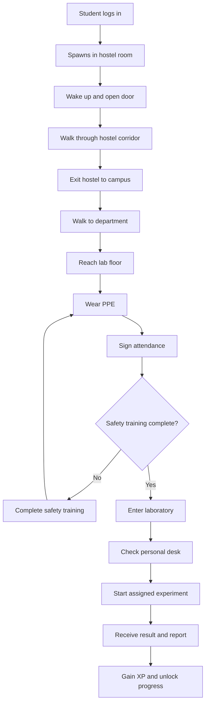
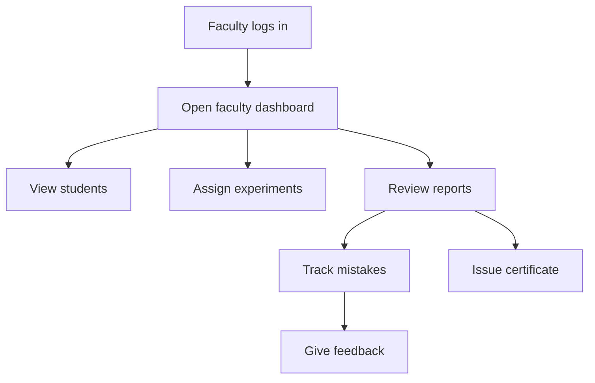
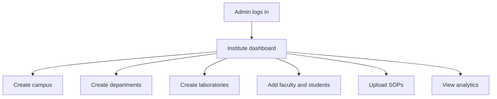
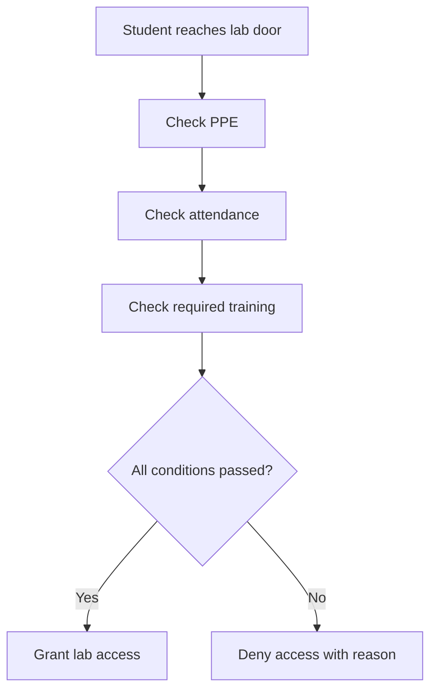

# User Flows

## Student Flow

```mermaid
flowchart TD
    Login["Student logs in"] --> Hostel["Spawns in hostel room"]
    Hostel --> Room["Wake up and open door"]
    Room --> Corridor["Walk through hostel corridor"]
    Corridor --> Campus["Exit hostel to campus"]
    Campus --> Department["Walk to department"]
    Department --> LabFloor["Reach lab floor"]
    LabFloor --> PPE["Wear PPE"]
    PPE --> Attendance["Sign attendance"]
    Attendance --> Check{"Safety training complete?"}
    Check -->|No| Training["Complete safety training"]
    Training --> PPE
    Check -->|Yes| Lab["Enter laboratory"]
    Lab --> Desk["Check personal desk"]
    Desk --> Experiment["Start assigned experiment"]
    Experiment --> Report["Receive result and report"]
    Report --> Progress["Gain XP and unlock progress"]
```

## Faculty Flow

```mermaid
flowchart TD
    Login["Faculty logs in"] --> Dashboard["Open faculty dashboard"]
    Dashboard --> Students["View students"]
    Dashboard --> Assign["Assign experiments"]
    Dashboard --> Reports["Review reports"]
    Reports --> Mistakes["Track mistakes"]
    Mistakes --> Feedback["Give feedback"]
    Reports --> Certificate["Issue certificate"]
```

## Institute Admin Flow

```mermaid
flowchart TD
    Login["Admin logs in"] --> Admin["Institute dashboard"]
    Admin --> Campus["Create campus"]
    Admin --> Departments["Create departments"]
    Admin --> Labs["Create laboratories"]
    Admin --> Users["Add faculty and students"]
    Admin --> SOP["Upload SOPs"]
    Admin --> Analytics["View analytics"]
```

## Lab Access Flow

```mermaid
flowchart TD
    Enter["Student reaches lab door"] --> PPE["Check PPE"]
    PPE --> Attendance["Check attendance"]
    Attendance --> Training["Check required training"]
    Training --> Permission{"All conditions passed?"}
    Permission -->|Yes| Access["Grant lab access"]
    Permission -->|No| Deny["Deny access with reason"]
```

